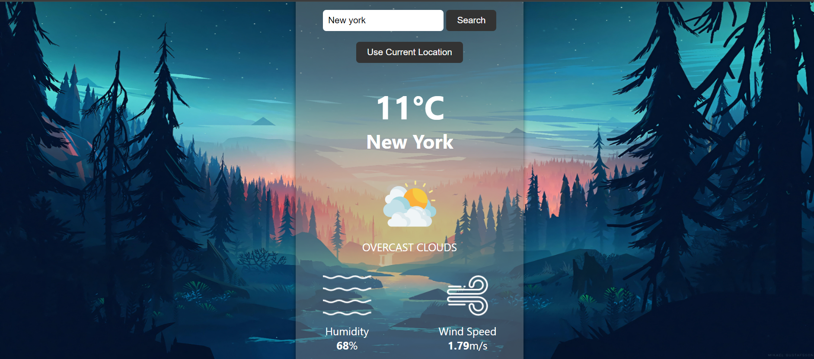

# WEATHER APP

This project was created using open-weather API. It is a single website build with HTML, CSS AND JAVASCRIPT.

Add you city to the search and press the search icon. You will see current city tempreture, sky-description, humidity and current date.

If you make a mistake with your city name, you will be alerted.

# Weather App

## Table of Contents
- [Overview](#overview)
- [Demo](#demo)
- [Screenshot](#screenshot)
- [Features](#features)
- [Technologies Used](#technologies-used)
- [How to Use](#how-to-use)
- [Contributing](#contributing)
- [What I Learned](#what-i-learned)
- [License](#license)

## Overview
The Weather App is a simple web application that allows users to check the weather conditions of different cities. It provides real-time weather data, including temperature, humidity, and wind speed. Users can search for a specific city or use their current location to get weather updates.

## Demo
You can try the Weather App here: [Live Demo](https://neooo17.github.io/Weather-app/)

### Screenshot

## Features
- **Search by City**: Users can enter the name of a city to check its current weather.
- **Use Current Location**: Users can click a button to fetch weather data for their current location.
- **Temperature**: Display of current temperature in Celsius.
- **City Name**: Show the name of the city for which the weather is displayed.
- **Weather Description**: Provides a brief description of the weather condition.
- **Humidity**: Shows the humidity percentage.
- **Wind Speed**: Displays the wind speed in meters per second.
- **Weather Icons**: Icons representing different weather conditions, such as clear, cloudy, drizzle, haze, rain, and snow.
- **Error Handling**: Alerts the user if the entered city is not found.
- **Background Image**: A visually appealing background image that changes based on the weather condition.

## Technologies Used
- HTML, CSS, JavaScript: Front-end development.
- OpenWeatherMap API: Used to fetch weather data.
- Geolocation API: To get the user's current location.
- GitHub: Version control and hosting the project.

## How to Use
1. Clone the repository to your local machine.
2. Open the `index.html` file in your preferred web browser.
3. Enter a city name and click the "Search" button to check the weather.
4. Alternatively, click the "Use Current Location" button to get the weather for your current location.
5. Enjoy the real-time weather information!

## Contributing
If you want to contribute to this project, feel free to submit a pull request or open an issue. Your contributions are highly appreciated.

## What I Learned
During the development of this project, I learned the following:
- How to create a simple web application using HTML, CSS, and JavaScript.
- Making API requests to fetch real-time data from OpenWeatherMap.
- Implementing geolocation functionality to get the user's current location.
- Error handling for cases where a city is not found.
- Styling and design considerations for an attractive user interface.

